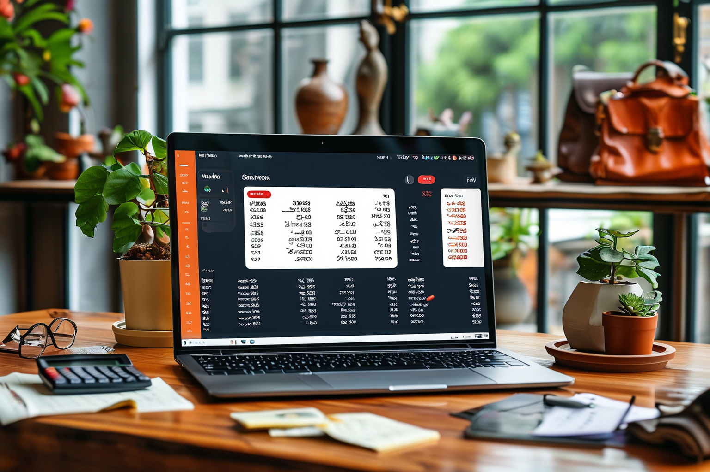
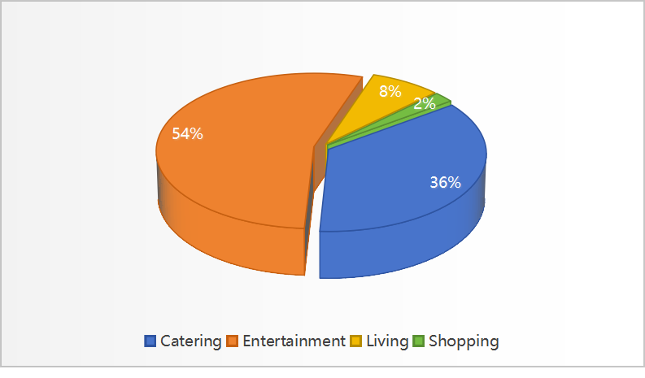
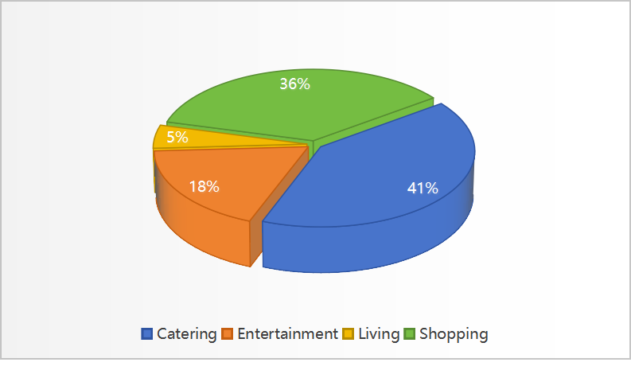
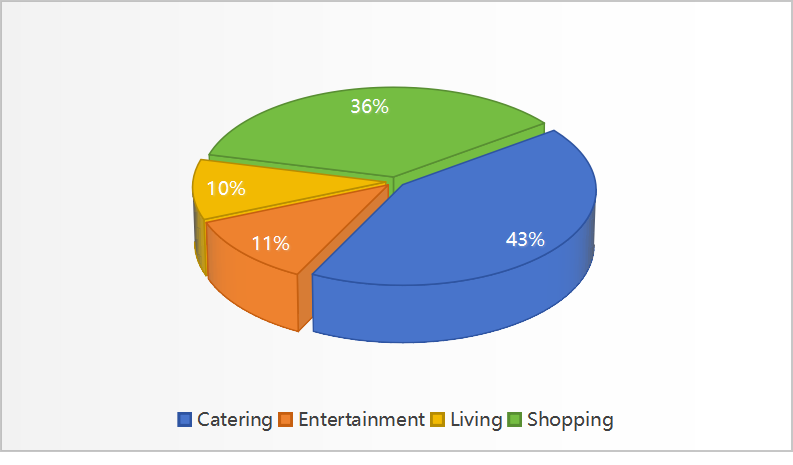
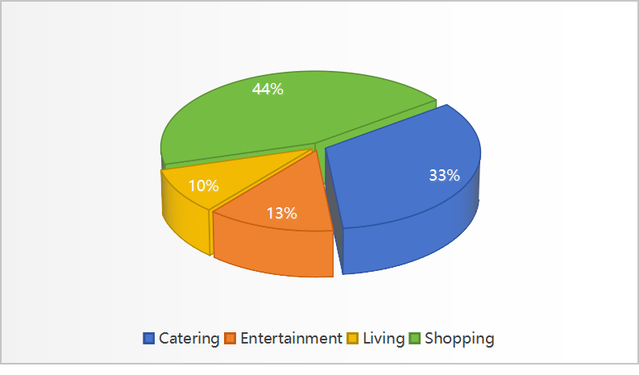

<!-- PROJECT LOGO -->
<p align="center">
  <h1 align="center">🌋 Software Engininging</h1>
  <p align="center">
    <a href="https://github.com/gengzijun"><strong>Zijun Geng</strong></a>
    ·
    <a href="https://github.com/monet-uta"><strong>Ye Wang</strong></a>
    ·
    <a href="https://github.com/Wenrui2"><strong>Wenrui Bai</strong></a>
    ·
    <a href="https://github.com/zhoujiayi2022213672"><strong>Jiayi Zhou</strong></a>
    ·
    <a href="https://github.com/HeYihui-Amos"><strong>Yihui He</strong></a>
    ·
    <a href="https://github.com/Gh0Zy"><strong>Yuyuan Zhao</strong></a>
    ·
    <a href="https://github.com/yymm1234"><strong>Wenxuan Zeng</strong></a>
  </p>
  <h2 align="center">EBU6304 Software Engineering</h2>
<div align="center"></div>
<p align="center">
  <p>
  Our team has crafted an <strong>AI - empowered Personal Finance Manager</strong>. It's a comprehensive desktop financial management tool for individuals. With a multimodal AI engine and a China - centred financial ecosystem, it offers precise, flexible, and secure financial lifecycle management. Suitable for all, from salaried workers and seniors to investors, it enhances financial literacy and budgeting skills. Beyond daily accounting and budget control, its core strengths in smart forecasting, risk alerts, and tax adaptation redefine financial management in the AI era. 
  </p>
  <a href="">
    
  </a>
<br>

## 📣 News
- [04/20/2025] 🔥 We release our app <a href="https://github.com/gengzijun/Software-Engining/tree/main/Version4"><strong>version4</strong></a>!
- [04/19/2025] 🔥 We release our app <a href="https://github.com/gengzijun/Software-Engining/tree/main/Version3.1"><strong>version3.1</strong></a>!
- [04/17/2025] 🔥 We release our app <a href="https://github.com/gengzijun/Software-Engining/tree/main/Version3"><strong>version3</strong></a>!
- [04/15/2025] 🔥 We release our app <a href="https://github.com/gengzijun/Software-Engining/tree/main/Version2.2"><strong>version2.2</strong></a>!
- [04/11/2025] 🔥 We release our app <a href="https://github.com/gengzijun/Software-Engining/tree/main/Version2.1"><strong>version2.1</strong></a>!
- [04/20/2025] 🔥 We release our app <a href="https://github.com/gengzijun/Software-Engining/tree/main/Version2"><strong>version2</strong></a>!
- [04/19/2025] 🔥 We release our app <a href="https://github.com/gengzijun/Software-Engining/tree/main/Version1.3"><strong>version1.3</strong></a>!
- [04/17/2025] 🔥 We release our app <a href="https://github.com/gengzijun/Software-Engining/tree/main/Version1.2"><strong>version1.2</strong></a>!
- [04/15/2025] 🔥 We release our app <a href="https://github.com/gengzijun/Software-Engining/tree/main/Version1.1"><strong>version1.1</strong></a>!
- [04/11/2025] 🔥 We release our app <a href="https://github.com/gengzijun/Software-Engining/tree/main/Version1"><strong>version1</strong></a>!
- [03/21/2025] We finish our first check!!!
- [03/15/2025] We release our datasets structure!
- [03/15/2025] Our prototype is comming soon. Stay tuned! 

## 📋 Datasets

We release our datasets here()！We collected consumption bills from 2024.01 to 2025.03. And divide all the data into 5 datasets on a quarterly basis.
An example of our data sample is below:

|Transaction time	|Type	| Amount (RMB)|
|---------------|----------|---------|
|2024/3/1 18:11 | Catering	 | ￥14.00 |

We divide consumption into <strong>4</strong> categories, which are: <strong>Catering</strong>、<strong>Entertainment</strong>、<strong>Shopping</strong>、<strong>Living</strong>. 

The following pie charts describes the number of consumption types in the first four dataset.


|  |  |
|----------|----------|
| <p align="center"><strong>2024.01-2024.03</strong></p> | <p align="center"><strong>2024.04-2024.06</strong></p>  |
|  |  |
| <p align="center"><strong>2024.07-2024.09</strong></p>  | <p align="center"><strong>2024.10-2024.12</strong></p>  |


## 🤝 Student Information

| Name          | QMUL Student ID | BUPT Student ID | Work |
|---------------|----------|---------|---------|
| <p align="center"><a href="https://github.com/gengzijun"><strong>Zijun Geng</strong></a></p>| <p align="center"><strong>221170571</strong></p> | <p align="center"><strong>2022213671</strong></p> | Responsible for building chart interface, implementing functions of SavingGoal interface, connecting AI function with all interfaces, designing UI|
| <p align="center"><a href="https://github.com/monet-uta"><strong>Ye Wang</strong></a></p>| <p align="center"><strong>221170618</strong></p> | <p align="center"><strong>2022213666</strong></p> |Responsible for the backend AI functions to realize the backend data generation for intelligent bill classification, prediction and suggestions. |
| <p align="center"><a href="https://github.com/Wenrui2"><strong>Wenrui Bai</strong></a></p>| <p align="center"><strong>221170504</strong></p> | <p align="center"><strong>2022213667</strong></p> |Responsible for building SavingGoal interface, implementing functions of SavingGoal interface, as well as completing some parts of backlog.|
| <p align="center"><a href="https://github.com/zhoujiayi2022213672"><strong>Jiayi Zhou</strong></a></p>| <p align="center"><strong>221170630</strong></p> | <p align="center"><strong>2022213672</strong></p> |Responsible for the design and functionality improvement of the history records page, as well as the connections between all pages and their detail modifications.|
| <p align="center"><a href="https://github.com/HeYihui-Amos"><strong>Yihui He</strong></a></p>| <p align="center"><strong>221170641</strong></p> | <p align="center"><strong>2022213679</strong></p> |Responsible for data collection and calibration, the initial design of the login interface, all functions of the main interface and dynamically converting user data into outputs on the chart interface|
| <p align="center"><a href="https://github.com/Gh0Zy"><strong>Yuyuan Zhao</strong></a></p>| <p align="center"><strong>221170445</strong></p> | <p align="center"><strong>2022213683</strong></p> |Be responsible for connecting the main page and the history interface, and write the readme for version1.2 and version1.3|
| <p align="center"><a href="https://github.com/yymm1234"><strong>Wenxuan Zeng</strong></a></p>| <p align="center"><strong>221169841</strong></p> | <p align="center"><strong>2022213608</strong></p> |Add animations and backgrounds to the login screen, enhance the interface and fonts, and complete the Readme section of Version 1 and Version 1.1.|

## 📜 Citation
```bib
@misc{Group96SoftwareEngining,
  author       = {Zijun Geng and Ye Wang and Wenrui Bai and Jiayi Zhou and Yihui He and Yuyuan Zhao and Wenxuan Zeng},
  title        = {Software Engininging},
  howpublished = {\url{https://github.com/gengzijun/Software-Engining}},
  note         = {Accessed: 2025-03-015},
  year         = {2025}
}
```
